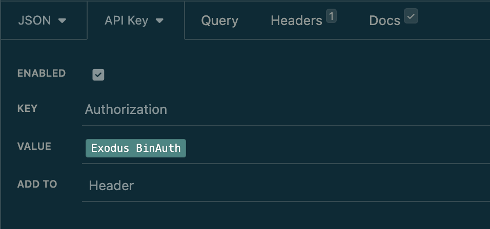
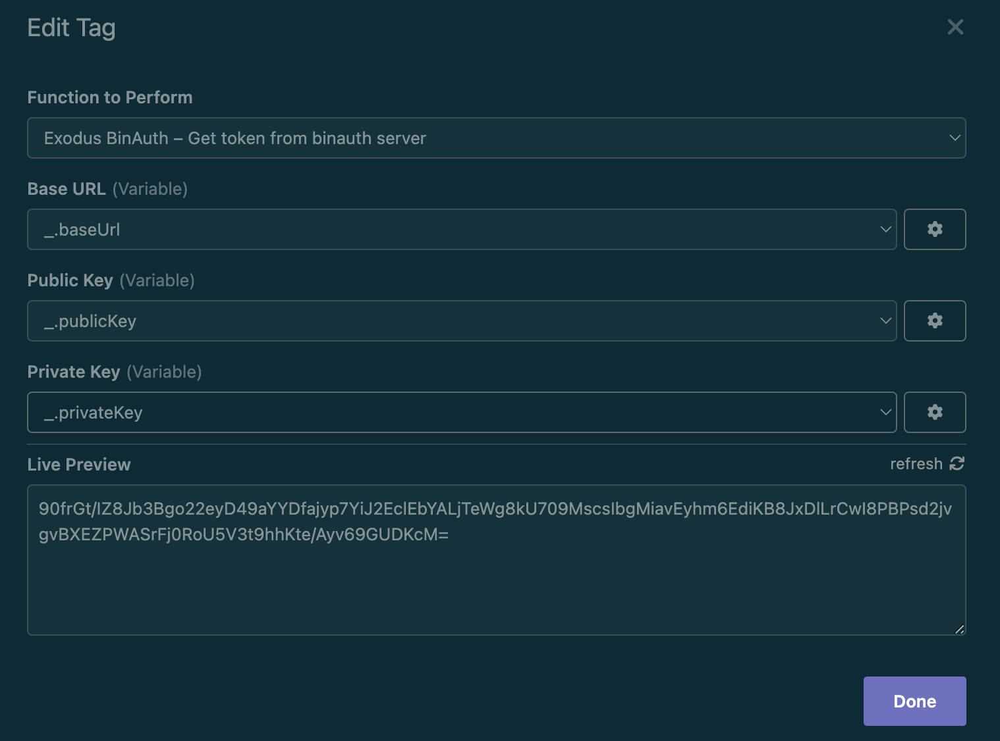

# Insomnia Plugin Exodus Binauth

> Insomnia Plugin for [Exodus Binauth](https://github.com/ExodusMovement/binauth)

## Getting Started

1. Settings - Plugins - Install Plugin: npm package name `insomnia-plugin-exodus-binauth`
2. Auth - API Key
   - KEY: Authorization
   - VALUE: CTRL-SPACE to open Autocompletation menu, and select `Exodus Binauth`

3. Click `Exodus Binauth` to edit, enter `Base URL`, `Public Key` and `Private Key` (You can use environment variable)

