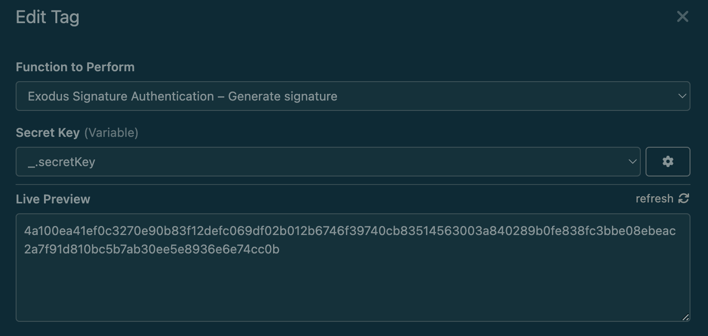

# Insomnia Plugin Exodus Signature Authentication

> Insomnia Plugin for [signature-based authentication](https://github.com/ExodusMovement/push-notifications/blob/84cdb6e0ce52cdc4451f33b2485a7900a1ad6610/service/client.js#L60)

## Getting Started

1. Settings - Plugins - Install Plugin: npm package name `insomnia-plugin-exodus-signature-authentication`
2. Auth - Bearer
   - TOKEN: CTRL-SPACE to open Autocompletation menu, and select `Exodus Signature Authentication`

3. Click `Exodus Signature Authentication` to edit, enter `Secret Key` (You can use environment variable)

